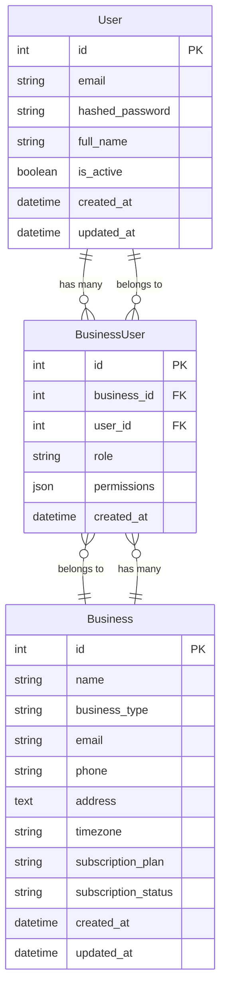
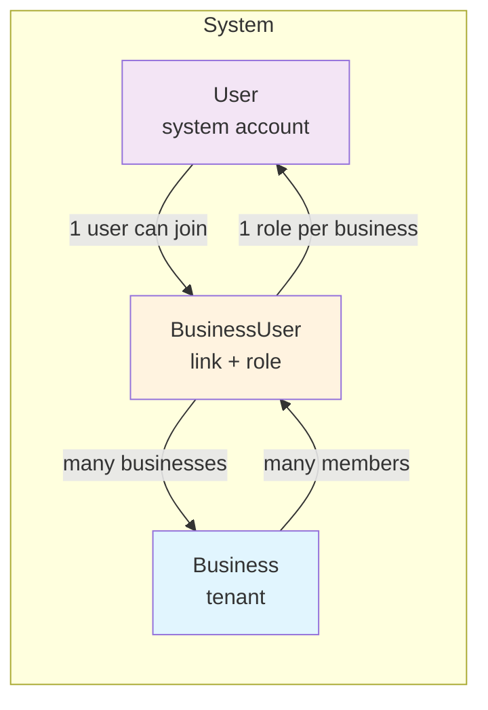
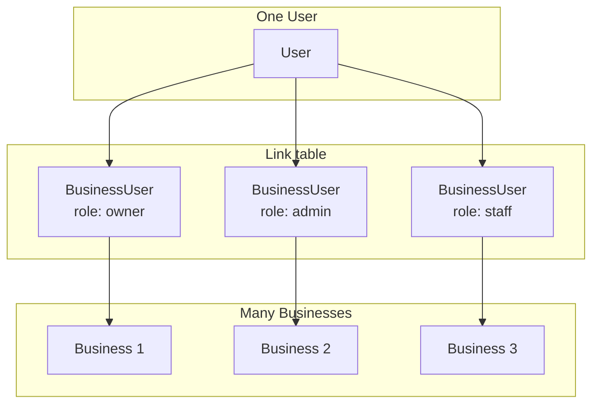
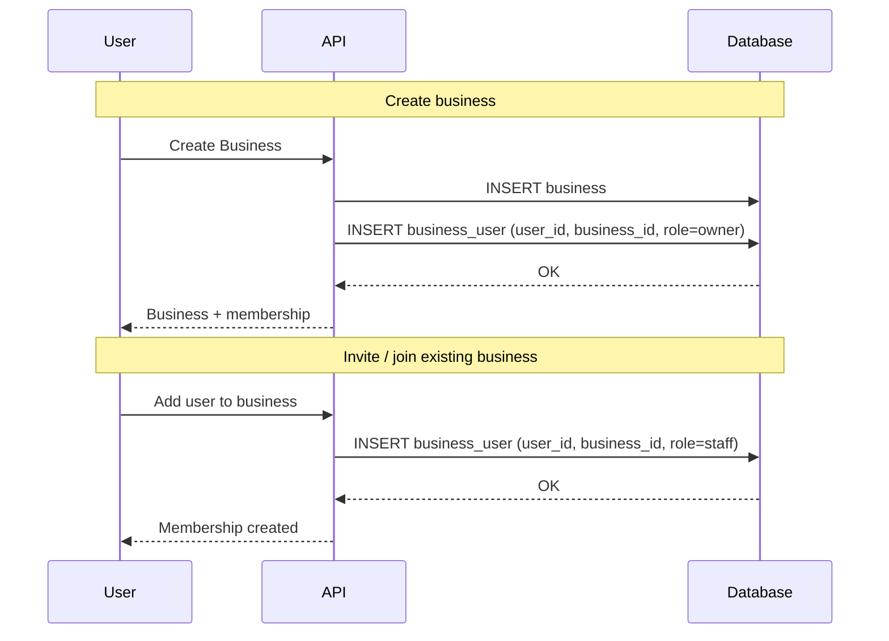
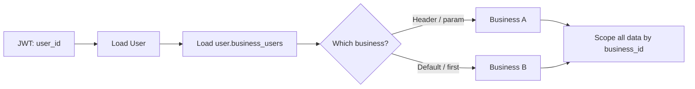

# Business Model — Flow Diagram

## Overview

- **User** — System account (one per person). Can belong to many businesses.
- **Business** — One tenant (e.g. one dental office or clinic). Has many members.
- **BusinessUser** — Link between User and Business with a **role** (owner / admin / staff) and optional **permissions**. Unique per `(business_id, user_id)`.

---

## 1. Entity relationship (current)

**Constraint:** One `(business_id, user_id)` pair is unique — a user can have only one role per business.

---

## 2. Multi-tenant flow (how users and businesses connect)

- **User:** Global account (email, password). Can belong to 0, 1, or many businesses.
- **Business:** One tenant (e.g. dental office, clinic). Has many members via **BusinessUser**.
- **BusinessUser:** Join between User and Business; stores **role** (owner / admin / staff) and optional **permissions**.

---

## 3. Relationship cardinality

- **User → BusinessUser:** 1 user → many BusinessUser rows (one per business).
- **Business → BusinessUser:** 1 business → many BusinessUser rows (one per member).
- **BusinessUser:** Unique on `(business_id, user_id)`.

---

## 4. Typical flows

### A. User creates or joins a business

### B. Resolving “current business” for a request

All tenant-scoped data (appointments, customers, etc.) will be filtered by the chosen **business_id** for that request.

---

## 5. Roles (BusinessUser.role)

| Role   | Typical use                          |
|--------|--------------------------------------|
| owner  | Created the business; full control   |
| admin  | Manage settings and users            |
| staff  | Day-to-day use (appointments, etc.)   |

`permissions` (JSON) can extend this with fine-grained flags later.

---

## 6. Summary

- **Business:** The tenant (one dental office, clinic, etc.).
- **User:** A person with a system account; can belong to many businesses.
- **BusinessUser:** Links User ↔ Business with one **role** (and optional permissions) per pair; unique on `(business_id, user_id)`.

If you want, we can add flows for “invite member” or “switch current business” next.
