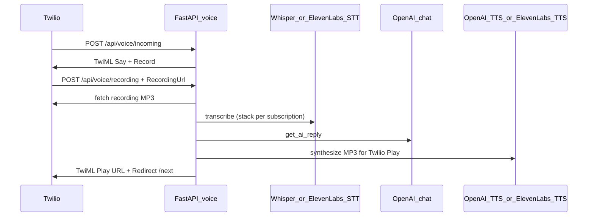

# Phase 3: Voice Processing

## Overview

Voice calls are handled by **Twilio** (inbound webhooks). Each turn:

- **Speech-to-text (STT)** — **OpenAI Whisper** (default) or **ElevenLabs Speech-to-Text** when the business is entitled and `ELEVENLABS_API_KEY` is set.
- **AI reply** — same agent as chat (`get_ai_reply`): business context, hours, appointments, intake, etc.
- **Text-to-speech (TTS)** — **OpenAI TTS** (default/fallback) or **ElevenLabs TTS** under the same rules.

Entitlements are driven by **`Business.subscription_plan`** and **`Business.subscription_status`** (see `app/services/voice_entitlements.py`):

| Plan    | STT/TTS stack |
|--------|----------------|
| `free` | OpenAI only    |
| `basic`, `premium` | ElevenLabs when API key is configured; otherwise OpenAI |

Businesses can set **`voice_stack`** (`openai` | `elevenlabs`) and optional **`elevenlabs_voice_id`** in **`BusinessSettings.ai_voice_settings`** when the plan allows. The dashboard **Voice & persona** tab (`/dashboard/{id}/voice`) uses **presets** (human-readable labels); the server maps presets to provider IDs—users never see raw ElevenLabs IDs.

Optional **`voice_profiles`** JSON (under `ai_voice_settings`) holds per-slot persona settings, e.g.:

```json
{
  "voice_profiles": {
    "default": {
      "preset_id": "openai_professional",
      "tone": "professional",
      "speed": 1.0,
      "expressive": false
    }
  }
}
```

On save, **`validate_ai_voice_settings`** syncs `preset_id` into legacy **`voice_stack`** / **`elevenlabs_voice_id`** for the live Twilio pipeline. Invalid values are stripped.

### Provider layer (code)

- **`app/services/voice/providers/`** — `OpenAIVoiceProvider`, `ElevenLabsVoiceProvider` (STT/TTS).
- **`app/services/voice_service.py`** — facade used by Twilio and preview: `transcribe_audio`, `text_to_speech`, `synthesize_for_preview`.
- **`app/services/voice_presets.py`** — catalog of preset IDs and labels for `GET .../voice/options`.

If ElevenLabs fails (timeout, HTTP error, empty audio), the pipeline **falls back** to OpenAI Whisper / OpenAI TTS so the call can continue.

## Flow



1. **Incoming call** → Twilio sends POST to `/api/voice/incoming?business_id={id}`.
2. **Answer & record** → TwiML answers, says a greeting, and starts recording (e.g. 15 s).
3. **Recording callback** → Twilio POSTs to `/api/voice/recording` with `RecordingUrl`, `CallSid`. We:
   - Fetch the recording (HTTP + Twilio auth)
   - Transcribe (Whisper or ElevenLabs per entitlements; fallback on failure)
   - Get AI reply (same as chat)
   - TTS to **MP3** (OpenAI or ElevenLabs; fallback on failure)
   - Store last STT/TTS providers on **`CallLog.voice_providers`** (e.g. `{"stt":"elevenlabs","tts":"openai"}`)
   - Return TwiML: `<Play>` our TTS URL, then `<Redirect>` to next
4. **Next turn** → `/api/voice/next` either starts another `<Record>` (up to 10 turns) or `<Hangup>`.

## Configuration

- **Twilio**: In the Twilio console, set your number’s “A Call Comes In” to **Webhook** and use the URL returned by `GET /api/businesses/{id}/voice/webhook-url` (e.g. `https://your-api.com/api/voice/incoming?business_id=1`).
- **Env — Twilio**: `TWILIO_ACCOUNT_SID`, `TWILIO_AUTH_TOKEN`, `TWILIO_PHONE_NUMBER`, `VOICE_WEBHOOK_BASE_URL` (must be a public URL so Twilio can reach it).
- **Env — OpenAI**: `OPENAI_API_KEY` (LLM + default/fallback STT/TTS).
- **Env — ElevenLabs** (optional): `ELEVENLABS_API_KEY`, `ELEVENLABS_DEFAULT_VOICE_ID`, `ELEVENLABS_PREMIUM_VOICE_IDS` (comma-separated extra voice IDs for premium), `ELEVENLABS_STT_MODEL_ID` (default `scribe_v1`), `ELEVENLABS_TTS_MODEL_ID` (default `eleven_multilingual_v2`).

See [`.env.example`](../.env.example) in the repo root.

### Database

After pulling changes that add **`call_logs.voice_providers`**, run Alembic:

```bash
alembic upgrade head
```

Migration: `006_call_log_voice_providers` (stores last turn’s STT/TTS provider keys, e.g. `{"stt":"elevenlabs","tts":"openai"}`).

## Endpoints

| Endpoint | Method | Purpose |
|----------|--------|---------|
| `/api/voice/incoming` | POST | Twilio: call arrived (query `business_id`) |
| `/api/voice/recording` | POST | Twilio: recording finished (form: CallSid, RecordingUrl) |
| `/api/voice/audio/{token}` | GET | Serve TTS audio for `<Play>` |
| `/api/voice/next` | GET/POST | Twilio: after play; next Record or Hangup |
| `/api/businesses/{id}/voice/webhook-url` | GET | Auth required; returns webhook URL for Twilio |
| `/api/businesses/{id}/voice/options` | GET | Auth required; presets, sample text template, subscription-aware stack |
| `/api/businesses/{id}/voice/preview` | POST | Auth + membership; short TTS sample (base64 MP3); **rate-limited** per user per business |

### Preview body (JSON)

| Field | Purpose |
|-------|---------|
| `text` | Optional override; default uses `preview_sample_text` with `{business_name}` |
| `preset_id` | Optional; defaults to saved `voice_profiles.default.preset_id` or stack-derived default |
| `speed` | Optional 0.75–1.35; passed to OpenAI TTS when supported |

Responses: `audio_base64`, `media_type`, `provider_used`. Uses the same API keys as production TTS (never client-side keys).

## Call state

- In-memory store maps `CallSid` → business_id, conversation_id, messages, turn_count (see `app/services/voice_call_state.py`).
- For production, replace with Redis so state survives restarts and works across workers.
- Conversations are persisted with `channel="voice"` and linked to the business.

## CallLog

- `CallLog` records phone_number, direction, status, optional transcript/intent, optional **`voice_providers`** (last turn’s STT/TTS backends).
- Created when the call starts; can be extended with status callback when the call ends (duration, status=completed).

## Automated tests

- **Entitlements** (plan vs stack, validation, `build_voice_options`): `tests/test_voice_entitlements.py`
- **Voice service with mocks** (httpx fakes for ElevenLabs; OpenAI paths stubbed): `tests/test_voice_service_mocked.py`

Run:

```bash
./venv/bin/python -m pytest tests/test_voice_entitlements.py tests/test_voice_service_mocked.py -v
```

ElevenLabs HTTP is exercised via **`httpx.Client`** mocks on `app.services.voice.providers.elevenlabs_provider`; OpenAI paths are stubbed with **`_openai_transcribe`** / **`_openai_tts`** monkeypatches so tests do not call external APIs.

## Environment (preview)

| Variable | Default | Purpose |
|----------|---------|---------|
| `VOICE_PREVIEW_RATE_PER_MINUTE` | `30` | Max TTS preview POSTs per user per business per minute (in-process limiter; resets on restart) |

## Roadmap (not implemented yet)

- **Caching** — Hash `(provider, voice_ref, speed, text)` for repeated phrases (Redis or LRU).
- **Streaming** — Twilio `<Play>` uses a file URL; true streaming may require Media Streams.
- **Usage tracking** — Per-tenant TTS/STT character counts for ElevenLabs cost visibility.
- **Per-tenant API keys** — Optional encrypted `Business` fields or Secret Manager references.
- **After-hours profile** — Select `voice_profiles.after_hours` when outside `business_hours` (resolver in `voice.py`).
